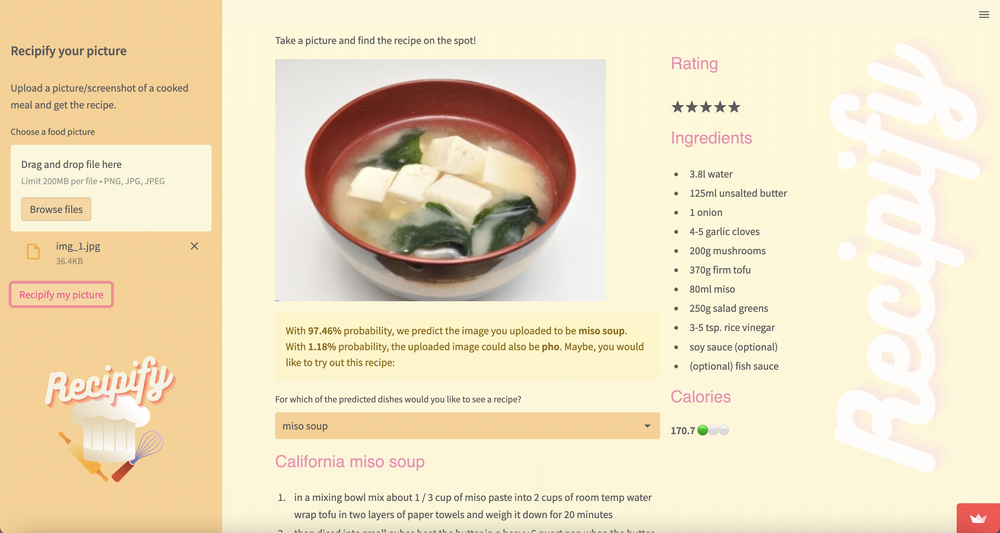

# Recipify

### What is Recipify?

You probably know the situation: Scrolling through social media and seeing a delicious-looking meal someone posted or being out and about and seeing someone eat something very appealing...
You would love to recreate that meal at home, but how would you go about it without knowing what it actually is?
For that, our application might come in handy! You just need a screenshot or picture of the meal.

Recipify uses deep learning (Convolutional Neural Network) to detect and recognize dishes. It will not only output the name and associated recipe of the dish, but also gives you nutritional information and recommends similar dishes you might like based on visual characteristics of the uploaded photo.

### Product
The product contains 4 key elements:

  * **Dish recognition** recognize a dish based on a picture or screenshot
  * **Recipe** based on the recognized dish, you will get an associated recipe
  * **Nutritional Information** based on a daily recommended intake, you will see a calorie-traffic-light and a plot of other nutritional values
  * **Similar looking dishes** based on the picture/screenshot you uploaded, Recipify will recommend another similar looking dish you might also like

Link to the app: https://dk1248-recipify-website-app-03uyve.streamlit.app/

Live presentation at Le Wagon: https://youtu.be/pxghH8AEcXg

### Methods used
* Deep Learning (Convolutional Neural Network trained on ~120.000 pictures of food of 251 categories)
* Data Analysis/Data Cleaning
* Data Visualization (exploratory data analysis and nutritional information plot with seaborn)
* created prediction API to deploy model on cloud
* Streamlit (building interactive web app)
* Docker (deployment)

### Creating the Frontend
Our Streamlit frontend accesses the stored model data on GCP and and generates the output in real-time

### Running it locally
To run the app locally, simply download and install it. If you are on a linux and use pip, simply run "pip install -e ." (without the quote signs, and don't ignore the dot at the end) from the app folder in your terminal. Start it on streamlit by running "streamlit run app.py", and open the indicated Network URL.
Please note that our CNN model file (`xception_continued_save_at_17.keras`) is too big and cannot be pushed to Github, you can find the file under the following link (https://drive.google.com/file/d/16qnAkot1O-_G23-FhN6ZJf5rsDpsrXnF/view?usp=sharing). You can download it and put in the backend folder for the correct execution of the app.

### Data Sources
**Food Picture Dataset:** https://www.kaggle.com/code/iambashar/food-250-inception-v3/data

**Recipe Dataset:** https://www.kaggle.com/datasets/shuyangli94/food-com-recipes-and-user-interactions

### Future Applications
We would like to keep on optimizing the model and improving the overall accuracy. On top, we would like to work on another feature that enables users to not only input a picture, but also a list of ingredients to get an appropriate recipe. Lastly, we would like to offer users more variety in the shown recipes. The goal is to not only see one recipe for e.g. the category Pizza, but 5-10 different ones users can choose between in a dropdown menu.

### About
Recipify was co-created by [Mariia Morskovatykh](https://github.com/mariamorskovatykh), [Anna-Lisa Heilscher](https://github.com/lisahlschr), [Malory Corteso](https://github.com/mcorteso) and [David Kohn](https://github.com/dk1248), with contributions from Luis Vega and Richard Hasenfelder as the conclusion project for the data science bootcamp at Le Wagon (batch 1014) in December 2022. The code is written in Python, hosted and published with Streamlit.

